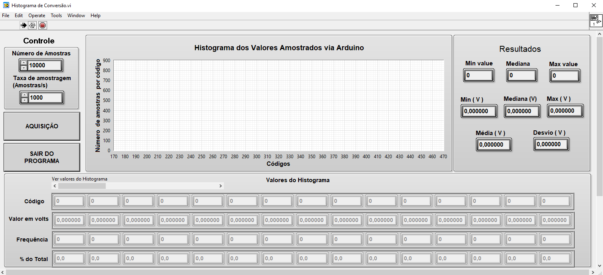

# Practical Learning of Analog-to-Digital Conversion Concepts with a Low-Cost Didactic Platform

Four Virtual Instruments (VI) developed in LabVIEW have been developed and are used throughout the experiment. 

The first one presents a table that maps the voltages into discrete numerical representations in decimal, binary, and hexadecimal formats. This VI also permits the alteration of the reference voltage and calculates the values of LSB and $\nicefrac{1}{2}$~LSB.

The second VI, called "Histogram", acquires a defined number of samples. After setting the waveform generator with a constant voltage, either with or without added noise, the data are sampled and displayed in bar graphs. The VI shows the minimum, maximum, and median digital output, along with their corresponding converted voltage readings. 

The third VI, called "Transfer Curve", assesses the transfer function of the ADC by plotting the digital output versus the analog input voltage measured by the digital multimeter.

The fourth VI explores the effect of aliasing in the time domain.

## License

The current software is designed for educational use only and does not serve any commercial interests.

